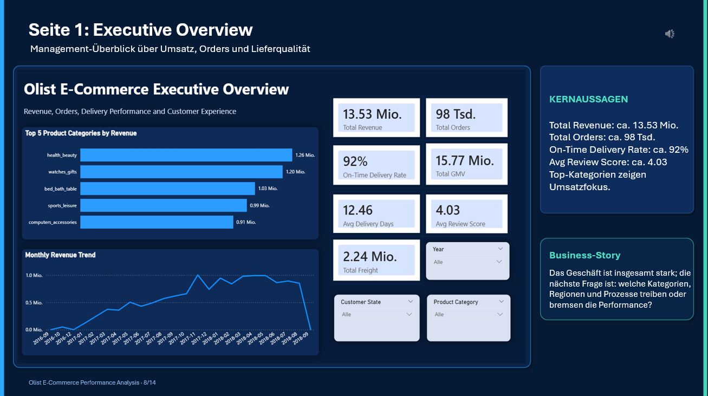
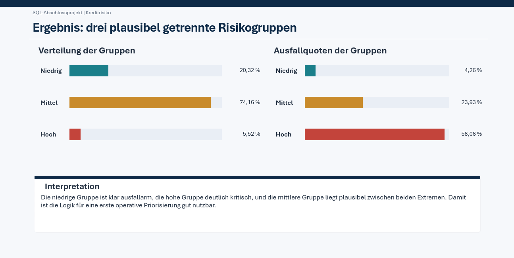
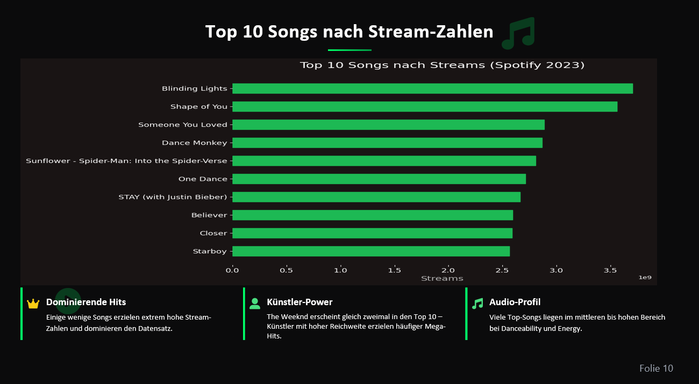
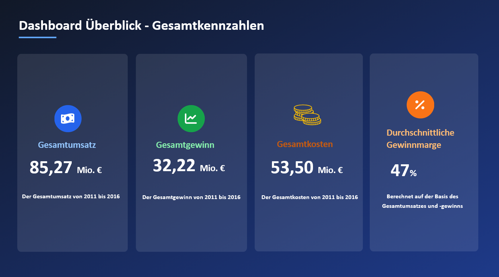

# Data Analytics Portfolio – Mohammad Amin Zamenali

**Junior Data Analyst | Power BI | SQL | Python | Business Intelligence**

Dieses Portfolio zeigt ausgewählte Projekte aus meiner erfolgreich abgeschlossenen Data-Analytics-Weiterbildung. Der Schwerpunkt liegt auf **Business Intelligence, Reporting, SQL-Analyse, Python-EDA, Datenqualität und verständlicher Ergebnispräsentation**.

Zusätzlich bringe ich praktische Berufserfahrung aus industrieller Qualitätssicherung und Produktion mit, einschließlich der Arbeit mit qualitätsrelevanten Daten in **SAP / SAP QM**.

---

## Ausgewählte Projekte

| Projekt | Was das Projekt zeigt | Tools |
|---|---|---|
| [Olist E-Commerce Performance Analysis](projects/02_olist_ecommerce_powerbi) | Management-Report mit Umsatz-, Bestell-, Liefer- und Customer-Experience-KPIs | Power BI, Power Query, DAX |
| [Wine Quality Classification](projects/01_wine_quality_knime_powerbi) | End-to-End Analyse von Datenbereinigung bis Klassifikation und Dashboard | KNIME, Power BI, Random Forest, Decision Tree |
| [Credit Risk SQL Analysis](projects/03_credit_risk_sql_analysis) | Datenqualität, fachliche Risikologik und wiederverwendbare SQL-View | SQL, CASE WHEN, Aggregationen, Views |
| [Spotify 2023 Python EDA](projects/04_spotify_2023_python_eda) | Datenbereinigung, Feature Engineering, Visualisierung und Korrelationsanalyse | Python, Pandas, Matplotlib |
| [Sales Performance Dashboard](projects/05_sales_dashboard_excel) | Interaktives Sales-Reporting mit KPI-Karten und Pivot-Auswertungen | Excel, Power Query, Pivot-Tabellen |

---

## Projekt-Highlights

### Olist E-Commerce Performance Analysis

Mehrseitiger Power-BI-Report zur Analyse von Umsatz, Bestellungen, Lieferperformance, Bewertungen und Produktperformance. Der Schwerpunkt liegt auf KPI-Logik, Datenmodellierung und einer klaren Business-Perspektive.

### Wine Quality Classification

End-to-End-Projekt mit Datenbereinigung, explorativer Analyse, Klassifikation und Modellbewertung in KNIME sowie Ergebnisvisualisierung in Power BI. Ein wichtiger methodischer Punkt war die Vermeidung von Data Leakage.

### Credit Risk SQL Analysis

SQL-Projekt zur Analyse von Kreditrisiken. Aus untersuchten Risikofaktoren wurde eine nachvollziehbare CASE-WHEN-Logik für Risiko-Gruppen entwickelt und in einer wiederverwendbaren View zusammengeführt.

### Spotify 2023 Python EDA

Explorative Datenanalyse mit Python und Pandas. Enthalten sind Datenbereinigung, Feature Engineering, Visualisierung und Korrelationsanalyse zur Einordnung möglicher Erfolgsfaktoren für hohe Streaming-Zahlen.

### Sales Performance Dashboard

Excel-Dashboard zur Analyse von Umsatz, Gewinn, Kosten, Marge, Regionen, Produktkategorien und zeitlicher Entwicklung.

---

## Technische Schwerpunkte

- **Business Intelligence & Reporting:** Power BI, Power Query, DAX-Grundlagen, Datenmodellierung, KPI-Reporting, Dashboarding
- **SQL & Datenbanken:** SQL, MySQL, PostgreSQL, JOINs, GROUP BY, CASE WHEN, Aggregationen, Views, Datenqualität
- **Python & Analytics:** Python, Pandas, NumPy, Matplotlib, Datenbereinigung, EDA, Feature Engineering
- **Machine Learning:** Scikit-Learn, Klassifikation, Random Forest, Decision Tree, Modellbewertung, Cross Validation
- **Excel:** Pivot-Tabellen, Power Query, KPI-Dashboards
- **Weitere Tools:** KNIME, SAP / SAP QM

---

## Projektstruktur

Jedes Projekt enthält eine eigene README mit Ziel, Vorgehen, Tools und Ergebnissen. Wo sinnvoll, sind zusätzlich Quellcode bzw. Notebook, Daten, Projektdokumentation und Screenshots enthalten.

Eine ausführlichere Übersicht der Projekte befindet sich in [`PROJECT_SUMMARIES_FOR_RECRUITERS.md`](PROJECT_SUMMARIES_FOR_RECRUITERS.md).

---

## Kontakt

- **Standort:** Chemnitz, Deutschland
- **LinkedIn:** [linkedin.com/in/mohammad-amin-zamenali](https://www.linkedin.com/in/mohammad-amin-zamenali/)
- **E-Mail:** amin.zamenali@gmail.com
