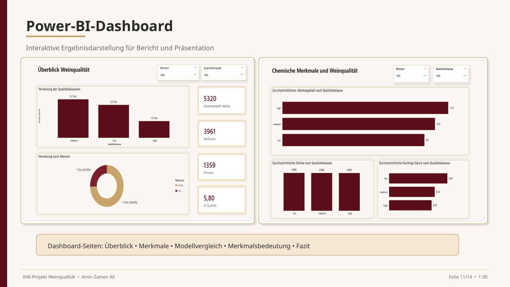

# Wine Quality Classification – KNIME + Power BI

End-to-End-Analyse zur Klassifikation von Weinqualität – von der Datenbereinigung über Machine Learning bis zur Ergebnisvisualisierung.

## Projektziel

Rotwein- und Weißweindaten wurden zusammengeführt, bereinigt und anhand chemischer Merkmale analysiert. Ziel war es, die Weinqualität nachvollziehbar in die Klassen **low**, **medium** und **high** zu klassifizieren und die Ergebnisse anschließend in Power BI verständlich aufzubereiten.

## Vorgehen

1. Rotwein- und Weißweindaten zusammenführen
2. Datenqualität prüfen und Datensatz bereinigen
3. Zielvariable `quality_category` bilden
4. ursprüngliche `quality`-Spalte aus den Modell-Features entfernen, um Data Leakage zu vermeiden
5. chemische Merkmale explorativ analysieren
6. Decision Tree und Random Forest trainieren und bewerten
7. Ergebnisse in einem Power-BI-Dashboard visualisieren

## Ergebnisse

- **5.320** bereinigte Wein-Datensätze
- **14** Analyse-Spalten
- **3** Qualitätsklassen
- **Random Forest** als bestes der verglichenen Modelle

Das Projekt verbindet Datenaufbereitung, explorative Analyse, Klassifikation, Modellbewertung und Reporting in einem durchgängigen Workflow.

## Tech Stack

`KNIME` · `Power BI` · `Excel` · `Random Forest` · `Decision Tree` · `Cross Validation` · `Data Cleaning` · `EDA`

## Repository-Inhalt

- [`data/`](data/) – Rohdaten und bereinigte Daten
- [`knime/`](knime/) – exportierter KNIME-Workflow
- [`docs/`](docs/) – Projektdokumentation
- [`images/`](images/) – Dashboard-Screenshot

## Nachgewiesene Kompetenzen

Datenbereinigung · Datenqualität · Klassifikation · Leakage-Vermeidung · Modellbewertung · KNIME-Workflows · Power-BI-Reporting · Ergebnisinterpretation
