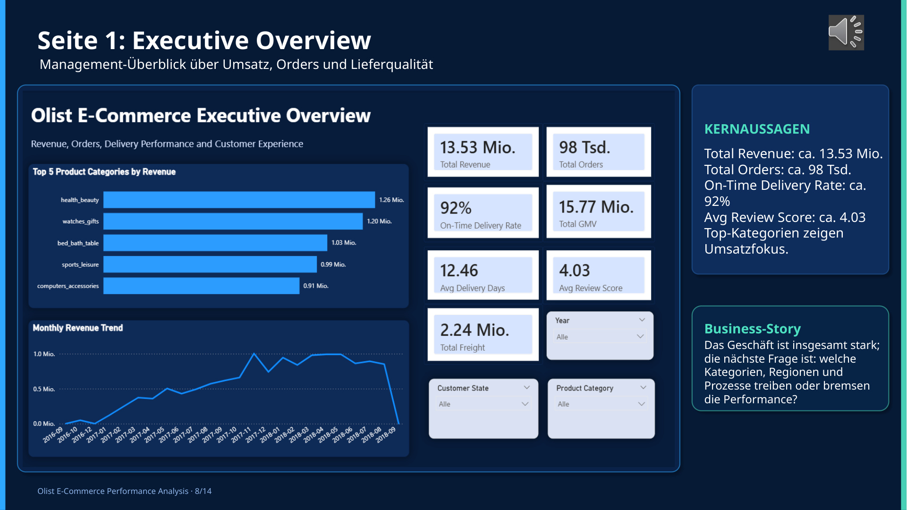

# Olist E-Commerce Performance Analysis – Power BI

Interaktiver Management-Report zur Analyse von Umsatz, Bestellungen, Lieferperformance und Customer Experience.

## Projektziel

Mehrere E-Commerce-Datentabellen wurden in Power BI aufbereitet und zu einem übersichtlichen Management-Report verbunden. Im Mittelpunkt standen zentrale Geschäftskennzahlen und die Frage, wie sich Sales, Lieferung, Kundenbewertungen und Produktperformance verständlich zusammenfassen lassen.

## Vorgehen

1. mehrere Olist-Datentabellen importieren
2. Daten in Power Query bereinigen und transformieren
3. Datenmodell für die Analyse aufbauen
4. zentrale KPIs mit DAX-Grundlagen erstellen
5. mehrseitigen Power-BI-Report strukturieren
6. Auffälligkeiten und Business-Zusammenhänge interpretieren

## Zentrale Kennzahlen

- **13,53 Mio.** Total Revenue
- **98 Tsd.** Total Orders
- **92 %** On-Time Delivery Rate
- **4,03** Average Review Score

Der Report verbindet Kennzahlen zu Umsatz, Bestellungen, Lieferung, Seller-Performance, Produktkategorien und Customer Experience in einer einheitlichen BI-Struktur.

## Tech Stack

`Power BI` · `Power Query` · `DAX-Grundlagen` · `Datenmodellierung` · `KPI Reporting` · `Business Intelligence`

## Repository-Inhalt

- [`docs/`](docs/) – Projektzusammenfassungen und begleitende Dokumentation
- [`images/`](images/) – Dashboard-Screenshot

## Nachgewiesene Kompetenzen

Power BI · Power Query · KPI-Logik · DAX-Grundlagen · Datenmodellierung · Dashboarding · E-Commerce Analytics · Business Storytelling
