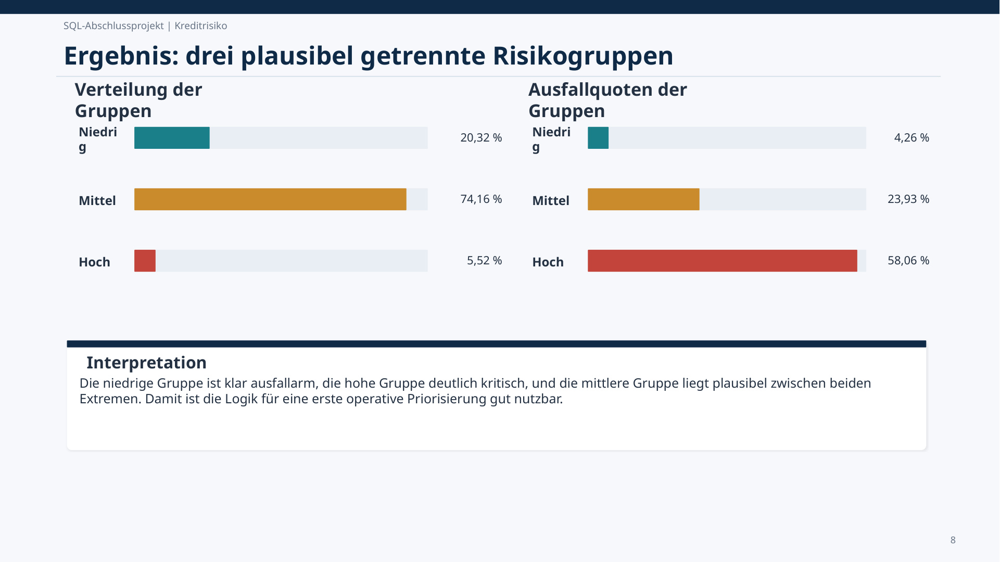

# Credit Risk SQL Analysis

SQL-Projekt zur Datenqualitätsprüfung, Analyse von Risikofaktoren und Entwicklung einer nachvollziehbaren regelbasierten Risikologik.

## Projektziel

Kreditdaten wurden systematisch geprüft und analysiert, um relevante Risikofaktoren zu erkennen und Kreditfälle nachvollziehbar in niedrige, mittlere und hohe Risikogruppen einzuteilen.

## Vorgehen

1. Datenbasis und Tabellenstruktur prüfen
2. Datenqualität, fehlende Werte und Plausibilität untersuchen
3. zentrale Risikofaktoren fachlich analysieren
4. regelbasierte `CASE WHEN`-Logik entwickeln
5. Kreditfälle in drei Risikogruppen einteilen
6. finale Logik in einer wiederverwendbaren SQL-View speichern
7. Ausfallquoten je Risikogruppe vergleichen und interpretieren

## Zentrale Ergebnisse

- **3** klar getrennte Risikogruppen
- **58,06 %** Ausfallquote in der hohen Risikogruppe
- finale View: `risiko_modell_v1`
- deutlich niedrigere Ausfallquote in der niedrigen Risikogruppe

Das Projekt zeigt SQL als Analyse- und Entscheidungswerkzeug: von Datenqualität und Exploration bis zu einer transparenten fachlichen Risikologik.

## Tech Stack

`SQL` · `CASE WHEN` · `Aggregationen` · `Views` · `Data Quality` · `Risk Analysis` · `Reporting`

## Repository-Inhalt

- [`sql/credit_risk_analysis.sql`](sql/credit_risk_analysis.sql) – vollständiges Analyse-Skript
- [`docs/`](docs/) – Projektzusammenfassungen und begleitende Dokumentation
- [`images/`](images/) – Ergebnisvisualisierung

## Nachgewiesene Kompetenzen

SQL-Analyse · Datenqualität · CASE-WHEN-Logik · Aggregationen · Views · Risikosegmentierung · Business Analytics · Ergebnisinterpretation
