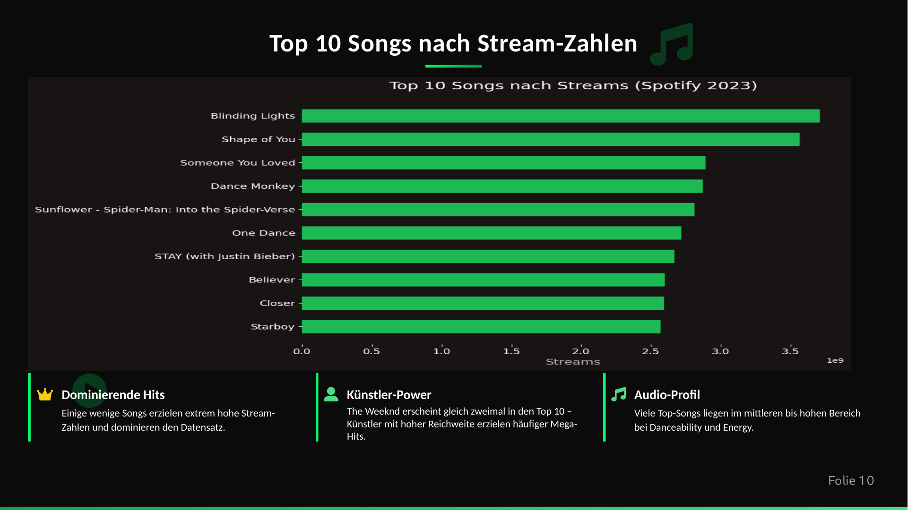

# Spotify 2023 Python EDA

Explorative Datenanalyse von Spotify-Songdaten mit Python, Pandas und Matplotlib.

## Projektziel

Der Spotify-Datensatz wurde bereinigt und analysiert, um Muster hinter hohen Streaming-Zahlen zu untersuchen. Neben der Datenaufbereitung wurden neue Merkmale erstellt und Zusammenhänge zwischen Plattformpräsenz, Audio-Eigenschaften und Streams untersucht.

## Vorgehen

1. Datensatz importieren und Datentypen prüfen
2. Daten bereinigen und analysierbar strukturieren
3. neue Features für die Auswertung erstellen
4. Top-Songs, Künstler und Plattformpräsenz visualisieren
5. Audio-Merkmale und Streaming-Zahlen vergleichen
6. Korrelationsanalyse durchführen und Ergebnisse einordnen

## Feature Engineering

Unter anderem wurden folgende Merkmale erstellt:

- `song_age`
- `stream_group`
- `bpm_group`
- `energy_group`
- `platform_score`
- `streams_log`

## Zentrale Ergebnisse

- **952** Songs im analysierten Datensatz
- **35** Spalten
- Korrelation von etwa **0,79** zwischen Playlist-Präsenz und Streams
- Playlist-Präsenz zeigte einen stärkeren Zusammenhang mit Streams als einzelne Audio-Merkmale

## Tech Stack

`Python` · `Pandas` · `Matplotlib` · `EDA` · `Feature Engineering` · `Correlation Analysis`

## Repository-Inhalt

- [`notebooks/spotify_2023_analysis.ipynb`](notebooks/spotify_2023_analysis.ipynb) – vollständige Python-Analyse
- [`data/`](data/) – analysierte Daten
- [`docs/`](docs/) – Projektzusammenfassungen und begleitende Dokumentation
- [`images/`](images/) – Visualisierungen

## Nachgewiesene Kompetenzen

Python · Pandas · Datenbereinigung · EDA · Feature Engineering · Visualisierung · Korrelationsanalyse · datenbasierte Interpretation
