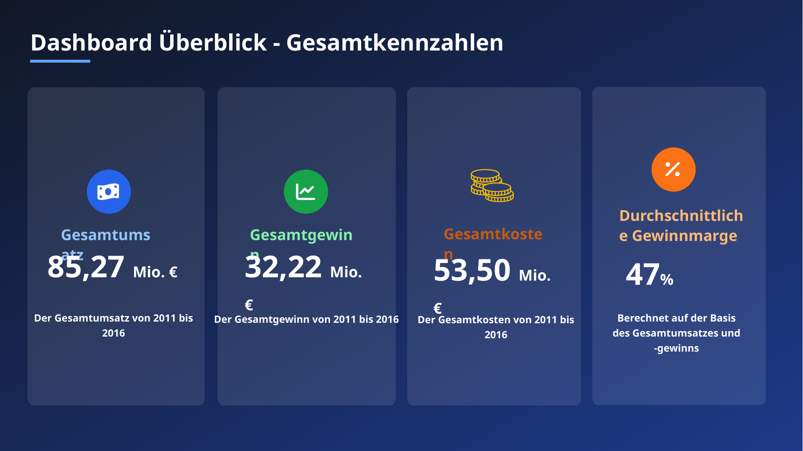

# Sales Performance Dashboard – Excel

Interaktives Excel-Dashboard zur Analyse zentraler Sales-Kennzahlen und Performance-Trends.

## Projektziel

Verkaufsdaten wurden bereinigt, strukturiert und in ein interaktives Dashboard überführt. Ziel war es, Umsatz, Gewinn, Kosten, Marge sowie Produkt- und Regionalperformance schnell verständlich darzustellen.

## Vorgehen

1. Ausgangsdaten bereinigen und strukturieren
2. Pivot-Tabellen für die Auswertung aufbauen
3. KPI-Karten erstellen
4. Umsatz, Gewinn, Kosten und Marge visualisieren
5. Produktkategorien, Regionen und Zeitverläufe vergleichen
6. zentrale Business Insights aus den Kennzahlen ableiten

## Zentrale Kennzahlen

- **85,27 Mio. EUR** Umsatz
- **32,22 Mio. EUR** Gewinn
- **47 %** Marge
- Analysezeitraum **2011–2016**

Das Projekt zeigt, wie sich klassische Excel-Werkzeuge mit Power Query, Pivot-Tabellen und einer klaren Dashboard-Struktur für Business Reporting verbinden lassen.

## Tech Stack

`Excel` · `Power Query` · `Pivot-Tabellen` · `KPI Cards` · `Dashboarding` · `Sales Analytics`

## Repository-Inhalt

- [`docs/`](docs/) – Projektzusammenfassungen und begleitende Dokumentation
- [`images/`](images/) – Dashboard-Screenshot

## Nachgewiesene Kompetenzen

Excel · Power Query · Pivot-Tabellen · KPI-Reporting · Dashboarding · Sales Analysis · Business Reporting
